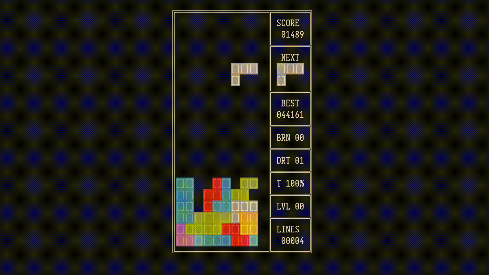

# xttrs - (NES) Tetris in x86 assembly

Linux only, nostd, in about 2000 loc.

## Showcase



## Controls

 - <kbd>←</kbd> move piece once to the left
 - <kbd>→</kbd> move piece once to the right
 - <kbd>↓</kbd> toggle soft drop (can't be hold because terminals don't support release events)
 - <kbd>X</kbd> rotate piece
 - <kbd>ESC</kbd> pause game

## Options

Starting with `-l` or `--level` followed by a number starts the game at that level (max 999).

## Building

To build you'll need:

 - Make
 - GNU As (doesn't have to be gnu, but must support GAS syntax)
 - ld

You should already have all that on any linux system

```shell
make build
```

Built binary will be called `xttrs`. The code doesn't link against any library so you should be able to run it from anywhere.

## Persistence

The best score per user is stored in `XDG_DATA_HOME/xttrs/best_score` (defaults to `HOME/.local/share/xttrs/best_score`).
